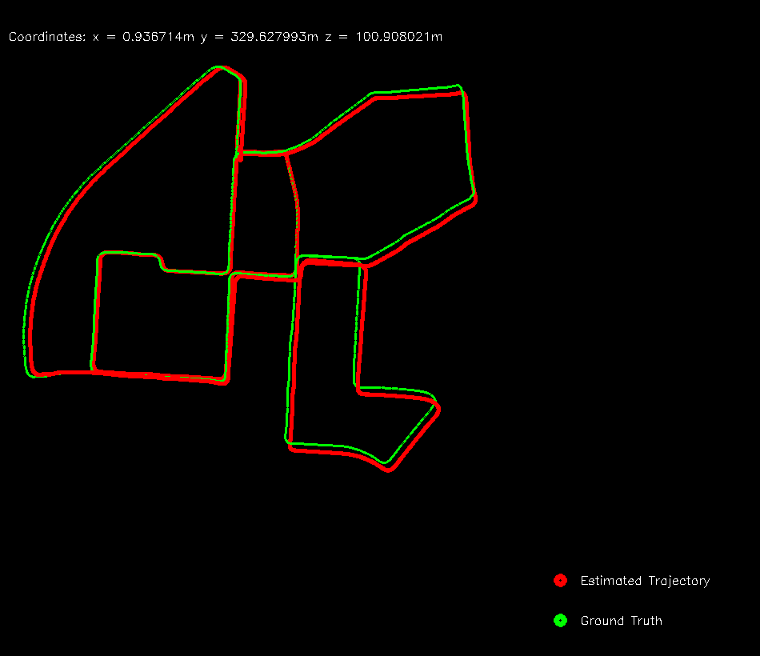

# Visual-Odometry
This project implements a monocular visual odometry system designed to work with the KITTI dataset. It estimates the trajectory of a vehicle using only a sequence of images from a single camera.

## Features

- Feature detection using Shi-Tomasi corner detector
- Feature tracking with Lucas-Kanade optical flow
- Motion estimation using RANSAC and Essential Matrix decomposition
- Scale estimation using GPS data
- Visualization of estimated trajectory

## Installation

1. Clone this repository:
```sh
git clone https://github.com/TejaswiniDilip18/Visual-Odometry.git
cd Visual-Odometry/
```

2. Create a build directory and compile:
```sh
mkdir build
cd build
cmake ..
make
```

## Usage

1. Download the KITTI odometry dataset from [KITTI website](http://www.cvlibs.net/datasets/kitti/eval_odometry.php).

2. Change dataset path, GPS data path and ground truth data wherever necessary in the vo_main.cpp file.

3. Run the visual odometry:
```sh
./vo
```
4. The program will display the estimated trajectory and save it to `trajectory.png`.

## Results

The estimated trajectory is shown below.
[](results/trajectory.png)

Demo video is shown below:
[](results/visual_odometry.mp4)

## Acknowledgements
The code is inspired from the following sources:
1. Avi Singh's implementation of monocular visual odometry algorithm [Monocular Visual Odometry using OpenCV](https://github.com/avisingh599/mono-vo.git)
2. Thanks to the [KITTI](http://www.cvlibs.net/datasets/kitti/eval_odometry.php) dataset for providing the benchmark data.
3. The UTM conversion code is used from [here](http://www.gpsy.com/gpsinfo/geotoutm/gantz/)

