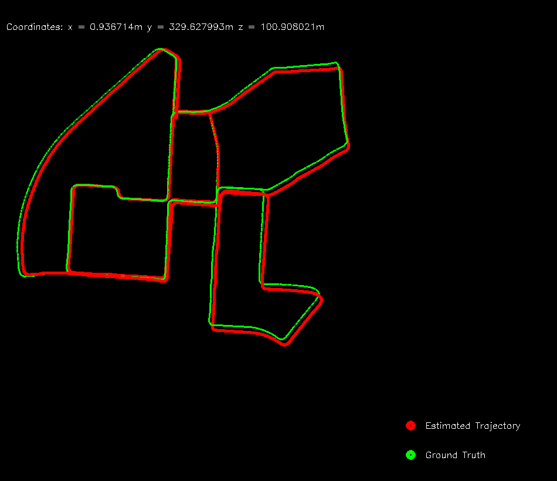
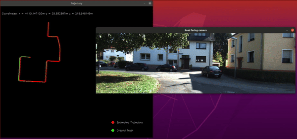

# Visual-Odometry
This project implements a monocular visual odometry system designed to work with the KITTI dataset. It estimates the trajectory of a vehicle using only a sequence of images from a single camera.

## Features

- Feature detection using Shi-Tomasi corner detector
- Feature tracking with Lucas-Kanade optical flow
- Motion estimation using RANSAC and Essential Matrix decomposition
- Scale estimation using GPS data
- Visualization of estimated trajectory

## Getting Started

Before running the project, clone the repository:
```sh
git clone https://github.com/TejaswiniDilip18/Visual-Odometry.git
cd Visual-Odometry/
```

### Dataset

1. Download the KITTI odometry dataset from [KITTI website](http://www.cvlibs.net/datasets/kitti/eval_odometry.php).

2. Update the dataset paths in the config.yaml file.

Now, you can either build and run with CMake or use Docker.

## Method 1: Running with CMake:
1. Create a build directory and compile.
```sh
mkdir build
cd build
cmake ..
make
```

2. Run the visual odometry:
```sh
./vo
```

3. The program will display the estimated trajectory and save it to `trajectory.png`.

## Running with Docker
You can use Docker to containerize and run this project without manually installing dependencies.

1. Build the Docker Image
```sh
docker build . -t vo_image
```

2. Enable X11 access for GUI applications (for trajectory visualization)
```sh
xhost +local:docker
```

3. Run the Container
```sh
docker run --rm -it \
    -e DISPLAY=$DISPLAY \
    -v /tmp/.X11-unix:/tmp/.X11-unix \
    -v /path/to/dataset:/dataset \
    --name vo_container \
    vo_image
```

4. (Optional) Restore security after running Docker
```sh
xhost -local:docker
```

## Results

The estimated trajectory is shown below.
[](results/trajectory.png)

Demo video is shown below:

[](results/visual_odometry.gif)

## Acknowledgements
The code is inspired from the following sources:
1. Avi Singh's implementation of monocular visual odometry algorithm [Monocular Visual Odometry using OpenCV](https://github.com/avisingh599/mono-vo.git)
2. Thanks to the [KITTI](http://www.cvlibs.net/datasets/kitti/eval_odometry.php) dataset for providing the benchmark data.
3. The UTM conversion code is used from [here](http://www.gpsy.com/gpsinfo/geotoutm/gantz/)

